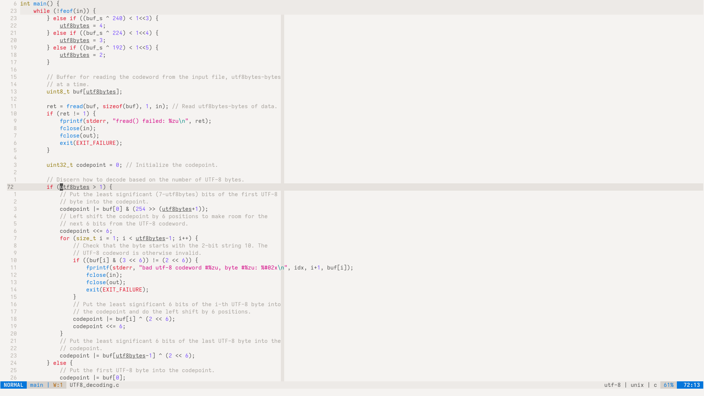

<p align="center">
    <picture>
        <source media="(prefers-color-scheme: dark)" srcset="https://raw.githubusercontent.com/perpetuatheme/perpetua/main/logo/logo_circle_dark.png">
        <source media="(prefers-color-scheme: light)" srcset="https://raw.githubusercontent.com/perpetuatheme/perpetua/main/logo/logo_circle_light.png">
        
    </picture>
    <h1 align="center">Perpetua for <a href="https://github.com/neovim/neovim">Neovim</a></h1>
</p>

<p align="center">
    A Neovim theme with support for native LSP, Treesitter, Lualine, and more!
</p>

<p align="center">
    <picture>
        <source media="(prefers-color-scheme: dark)" srcset="./assets/screenshot-dark.png">
        <source media="(prefers-color-scheme: light)" srcset="./assets/screenshot-light.png">
        
    </picture>
</p>

> [!WARNING]
> The project is under active development. Things are subject to change.

## Installation

Use your favorite plugin manager.

**[lazy.nvim](https://github.com/folke/lazy.nvim)**

```lua
{ 'perpetuatheme/nvim', name = 'perpetua' }
```

**[mini.deps](https://github.com/echasnovski/mini.deps)**

```lua
MiniDeps.add({ source = 'perpetuatheme/nvim', name = 'perpetua' })
```

**[paq-nvim](https://github.com/savq/paq-nvim)**

```lua
{ 'perpetuatheme/nvim', as = 'perpetua' }
```

**[pckr.nvim](https://github.com/lewis6991/pckr.nvim)**

```lua
{ 'perpetuatheme/nvim' } -- custom name not supported yet
```

## Usage

Choose the desired ambience and apply it using your preferred configuration
language.

**VimL**

```vim
colorscheme perpetua " defaults to perpetua-dark
colorscheme perpetua-light
colorscheme perpetua-dark
```

**Lua**

```lua
vim.cmd.colorscheme('perpetua') -- defaults to perpetua-dark
vim.cmd.colorscheme('perpetua-light')
vim.cmd.colorscheme('perpetua-dark')
```

## Screenshots

<details>
    <summary>Light</summary>
    <figure>
        
        <figcaption>Perpetua light ambience on Neovim editing a C source file.</figcaption>
    </figure>
    <br>&nbsp;
    <figure>
        
        <figcaption>Perpetua light ambience on Neovim editing a Go source file.</figcaption>
    </figure>
    <br>&nbsp;
    <figure>
        
        <figcaption>Perpetua light ambience on Neovim editing a Lua source file.</figcaption>
    </figure>
    <br>&nbsp;
    <figure>
        
        <figcaption>Perpetua light ambience on Neovim editing a Nix source file.</figcaption>
    </figure>
</details>

<details>
    <summary>Dark</summary>
    <figure>
        
        <figcaption>Perpetua dark ambience on Neovim editing a C source file.</figcaption>
    </figure>
    <br>&nbsp;
    <figure>
        
        <figcaption>Perpetua dark ambience on Neovim editing a Go source file.</figcaption>
    </figure>
    <br>&nbsp;
    <figure>
        
        <figcaption>Perpetua dark ambience on Neovim editing a Lua source file.</figcaption>
    </figure>
    <br>&nbsp;
    <figure>
        
        <figcaption>Perpetua dark ambience on Neovim editing a Nix source file.</figcaption>
    </figure>
</details>

<br>&nbsp;
<hr>
<p align="center">
    <small>© Copyright 2023–present, The Perpetua Authors.</small>
</p>
